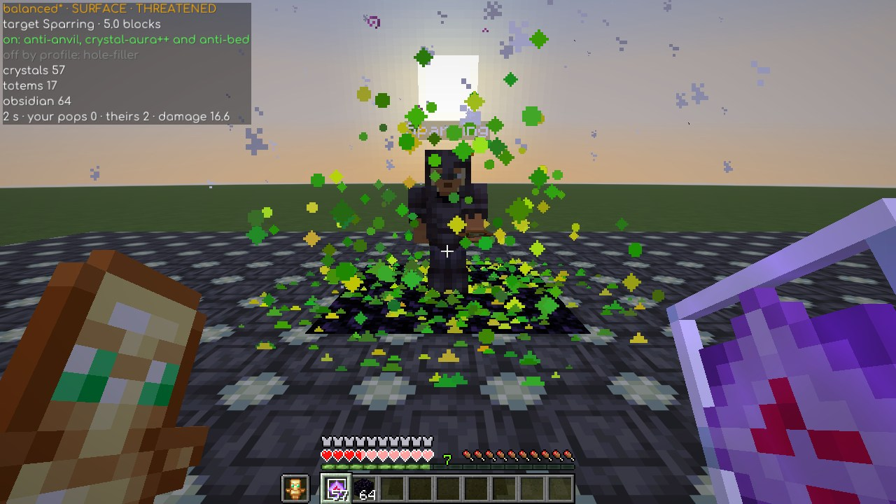
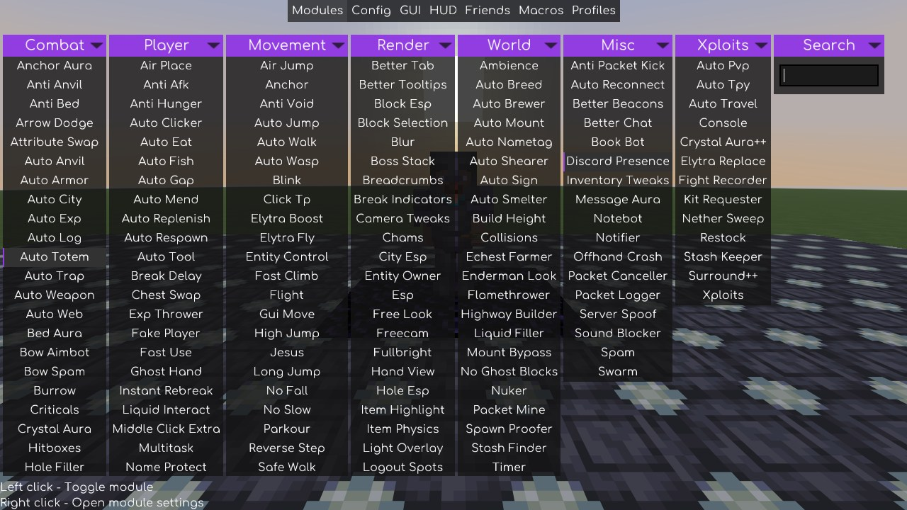
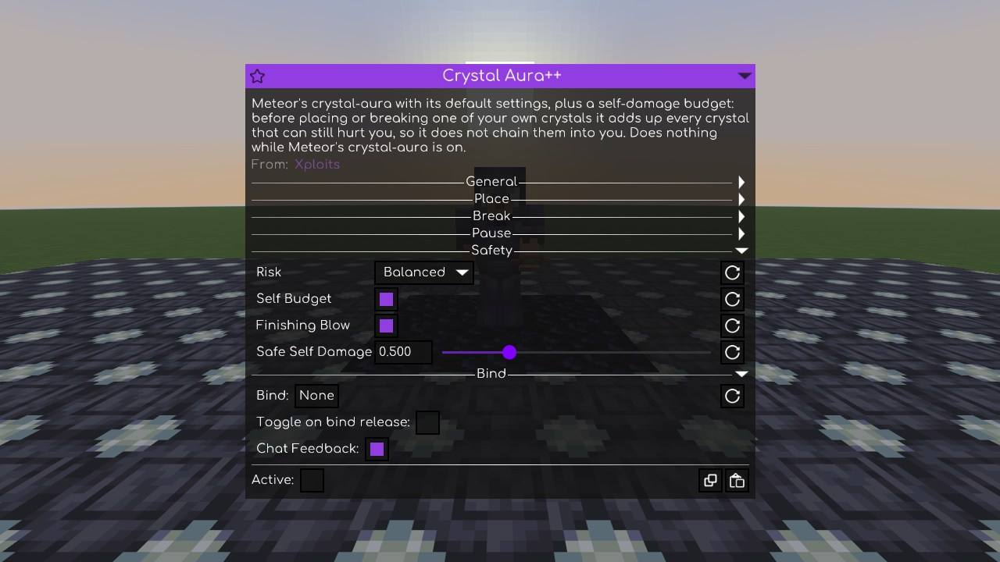
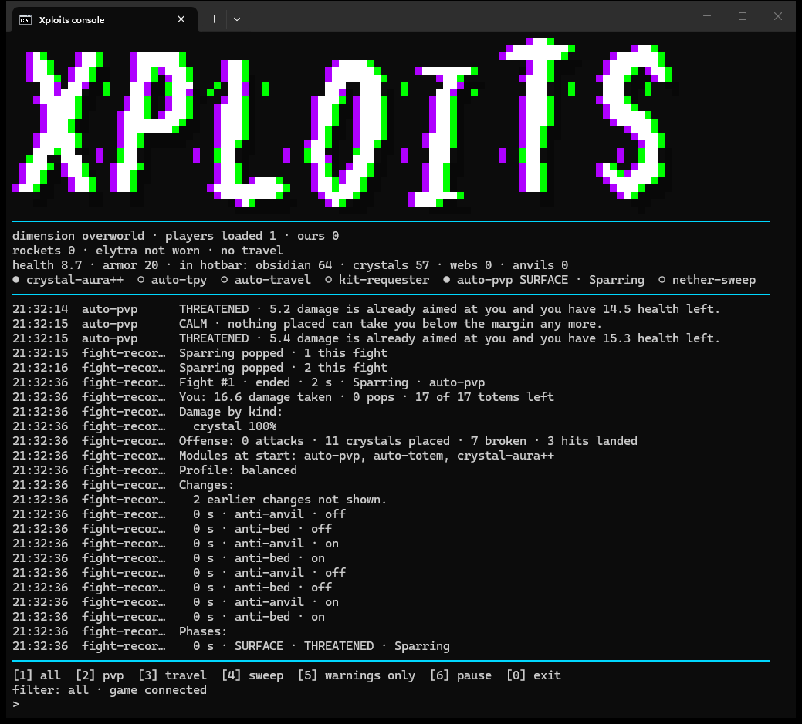

[English](README.md) · **Español**

# Xploits

Addon de [Meteor Client](https://meteorclient.com/) para Minecraft **1.21.11**, pensado para 6b6t y
otros servidores anarchy. Once módulos en la última versión, que se encienden por separado; `restock`, el duodécimo, aún no está publicado.

> **Nuevo, experimental, aún no está en ninguna versión publicada: `restock`.** Llega en la siguiente. Construye con Litematica y `litematica-printer` como hoy: cuando se acaba un
> bloque que la construcción aún necesita, `restock` pausa el printer, va al cofre más cercano que marcaste (o que
> recuerda `stash-keeper`), coge lo que necesita el resto de la construcción, vuelve y lo reanuda. También funciona con
> cajas de shulker: las que llevas encima y las que hay en tus contenedores. Mira
> [`restock`](#restock--ir-a-buscar-bloques-para-tu-construcción-de-litematica).

## Por qué Xploits

- **`crystal-aura++` va a por la muerte, y nunca te mata a ti.** Con el rival al borde de la muerte lo
  remata en todos los niveles de riesgo, donde la 0.7.0 no hacía nada (7 de 9 tandas en el banco de la
  0.8.0; en las otras dos no hizo ningún daño, como también le pasa a veces al aura de Meteor en esa
  escena). Solo pasa de tu reserva para matar, solo mientras llevas un tótem y otro de repuesto, y nunca
  por debajo de 2 de vida en los demás casos.
- **Hace más daño que el `crystal-aura` de Meteor donde importa.** Con el rival yendo y viniendo, 38 de
  daño frente a 31; con él más alto que tú, 297 frente a 287; más bajo, 309 frente a 303; tras una
  cobertura, 500 frente a 490. Donde va por detrás (mientras te mueves, y el intercambio a campo
  abierto) lo dice: mira los
  [problemas conocidos](docs/known-issues.md).
- **Tus propios cristales nunca te dejaron por debajo de tu reserva en ninguna tanda del banco de la
  0.8.0**: 81 escenarios, tres tandas de cada uno de los medidos, en todos los niveles de riesgo,
  contra rivales que atacan, rompen tus cristales y te bloquean los sitios. El `crystal-aura` de Meteor
  bajó hasta 0,1 de vida en el mismo banco.
- **`auto-pvp` enciende los módulos de combate adecuados en el momento adecuado** — cristales, trampas,
  telarañas, surround, rellenar agujeros y el resto — y solo apaga los que encendió él.
- **`fight-recorder` te dice por qué moriste**: un fichero JSON por pelea con el reparto de daño, tus
  tótems y cristales, y su mejor suposición de la causa. No guarda posiciones.
- **`auto-travel` te lleva volando a algún sitio sin dejar una flecha hacia tu base** (un patrón de
  señuelo rompe tu rastro), y **`nether-sweep`** peina el Nether para encontrar bases ajenas.
- **Ningún módulo hace algo a medias sin decirlo.** Si no puede cumplir lo que promete, se niega y
  explica qué ajuste tocar, en vez de hacer algo parecido y callar.

`crystal-aura++` está **medido, no solo prometido**: cada versión se prueba dentro del juego contra el
`crystal-aura` de Meteor, y los números están en
[la tabla de más abajo](#crystal-aura--crystal-aura-con-un-suelo-bajo-tu-vida).

## Capturas



`auto-pvp` manejando `crystal-aura++`, en el momento en que salta el tótem del rival. Arriba a la izquierda,
el panel `xploits-pvp` del HUD: perfil y postura, objetivo y distancia, los módulos que encendió, tus
recursos y la pelea en curso.

| | |
|---|---|
|  |  |
| La categoría **Xploits**, junto a las de Meteor en la ClickGUI. | Los ajustes propios de `crystal-aura++`: `risk`, `self-budget` y `finishing-blow`. |



La ventana de `console`: el logo, el estado del juego (vida, armadura, lo que llevas en la barra, qué
módulos están encendidos) y todo lo que dicen los módulos, sin coordenadas. Aquí, el resumen que hace
`fight-recorder` de la pelea que acaba de terminar.

Las cuatro las saca el banco en un mundo de prueba, sin ningún jugador ni servidor real en pantalla, y se
vuelven a sacar en cada versión (`tools/shots.ps1`).

---

## Antes de instalar

**Copia `xploits-<versión>.jar` a la carpeta `mods/` de tu instancia**, junto a Meteor, y **borra
cualquier `xploits-*.jar` anterior**: el nombre lleva la versión, y con dos a la vez el addon se carga
dos veces. Reinicia el juego. Los módulos salen en la ClickGUI, categoría **Xploits**. Qué cambia en
cada versión: [CHANGELOG](CHANGELOG.md).

### Qué necesitas instalado, y qué deja de funcionar si falta

Este addon **se apoya en otros mods a propósito**: cuando algo ya está resuelto y bien resuelto, lo
usa en vez de reimplementarlo peor. El precio es que hay que tenerlos.

| Mod | Obligatorio para | Si falta |
|---|---|---|
| **Meteor Client 1.21.11** | Todo | El addon no carga |
| **[Baritone](https://github.com/cabaletta/baritone)** | `auto-travel`, `nether-sweep`, `restock` | `auto-travel` y `nether-sweep` **se niegan a lanzar**, `restock` (aún sin publicar) **se niega a arrancar**, y cada uno lo dice. Los demás módulos funcionan igual |
| **[Litematica](https://modrinth.com/mod/litematica)** 0.26.14, con su librería **malilib** | `restock` | `restock` **se niega a arrancar** y lo dice. Los demás módulos funcionan igual; Xploits carga sin ella |
| **[Trouser Streak](https://github.com/etianl/Trouser-Streak)** → `NewerNewChunks` | `nether-sweep` | El barrido vuela, pero **replanifica terreno que ya habías cubierto** y no deja rastro para la próxima vez. Avisa antes de despegar |
| **Trouser Streak** → `BaseFinder` | `nether-sweep` | El barrido vuela y **no encuentra nada**: es quien detecta portales, skybuilds y construcciones en el techo. Avisa antes de despegar |
| **`stash-finder`** (viene con Meteor) | `nether-sweep` | El barrido vuela y no registra contenedores. Avisa antes de despegar |

⚠️ **Los tres detectores de `nether-sweep` tienen que estar encendidos, no solo instalados.** El
módulo te avisa con toast antes de despegar si alguno falta, **pero no te lo impide**: puedes volar
una hora y no registrar nada.

### Qué módulos de Meteor toca el addon

Esto conviene saberlo porque son módulos **tuyos** que el addon enciende, apaga o consulta.

| Quién | Qué toca | Cómo |
|---|---|---|
| `auto-pvp` | El aura de cristal que elige `crystal-module` — `crystal-aura` de Meteor de fábrica, `crystal-aura++` propia de Xploits con `xploits++` — más `auto-trap`, `auto-web`, `auto-anvil`, `auto-city`, `surround` y `hole-filler` (o, en su lugar, `surround++` propio de Xploits, con `shell-module` en `xploits++`), `anti-anvil`, `anti-bed`, `anti-anchor` | Los enciende y apaga según la situación. **Solo apaga los que encendió él**: si tocas uno a mano, deja de tocarlo. Nunca toca el aura que `crystal-module` no eligió |
| `auto-pvp` | Tu **lista de amigos de Meteor** | Mete a los tuyos mientras está encendido, para que los cinco módulos de combate tampoco les ataquen. Al apagarlo quita **solo los que puso él** |
| `auto-pvp` | El ajuste `anti-suicide` de `crystal-aura` | Solo lo **lee**, para saber si puede fiarse de que Meteor no te mate con tu propio cristal |
| `surround++` | `burrow` | Solo con su ajuste `burrow` encendido (apagado de fábrica): lo enciende para un solo burrow, y el `burrow` de Meteor se apaga solo después |
| `auto-travel`, `nether-sweep` | `elytra-fly`, `elytra-replace` | Los toman prestados durante el vuelo y los devuelven **al estado que tenían** |
| `auto-travel`, `nether-sweep` | Cinco ajustes de **Baritone** | Los cambia al despegar y los devuelve al aterrizar. ⚠️ Baritone los guarda en disco — igual que `elytraTermsAccepted`, `elytraPredictTerrain`, `elytraNetherSeed` (si se puso) y su propia censura, que quedan cambiados para siempre |
| `restock` | Cinco ajustes de **Baritone** | Mientras está encendido: `allowBreak`, `allowPlace` y `allowWaterBucketFall` apagados, para que Baritone no rompa ni ponga nada por el camino, `censorCoordinates` y `censorRanCommands` encendidos. Al pararse vuelven los cinco a tus propios valores (`baritone-settings`: `MINE`, de fábrica), o los tres primeros a los de fábrica de Baritone (`DEFAULTS`). ⚠️ Baritone los guarda en disco; si el juego se cierra con él encendido, `restock` los devuelve la próxima vez que entras en un mundo |
| `restock` | El modo de impresión de `litematica-printer` | Lo apaga antes de un viaje o de vaciar una caja y lo vuelve a encender después, **solo si estaba imprimiendo y sigue apagado** (si lo encendiste o apagaste tú entretanto, manda lo tuyo). Si el juego se cierra a mitad de viaje o de vaciar una caja, se vuelve a encender al entrar de nuevo en un mundo |
| `restock` | `anti-afk`, `auto-walk`, `auto-replenish`, `inventory-tweaks`, `scaffold`, `air-place`, `nuker`, `highway-builder`, `liquid-filler`, `excavator`, `infinity-miner`, `echest-farmer`, `spawn-proofer`, `timer`, `speed-mine` | Solo los **lee**: no arranca mientras uno esté encendido, y se para, nombrándolo, si enciendes uno con él encendido |

Todo esto, con el detalle de qué persiste y qué puede salir mal, en [Seguridad](docs/security.md).

---

## Los doce módulos

### `auto-travel` — volar a algún sitio sin dejar una flecha hacia tu base

Vuela con elytra usando Baritone, por una ruta con **patrón de despiste** para que tu traza no sea
una recta que apunte a donde vives.

**Encenderlo no vuela**: arma el viaje y espera. Se lanza con `.xploits travel go`.

**El destino se pide de tres maneras** (`destination-mode`):

| Modo | Qué pides | Ajustes |
|---|---|---|
| `COORDINATES` | Un punto del mundo | `x`, `z` |
| `RELATIVE` | Un desplazamiento desde donde estés: 5000 y −3000 es «5000 en X y −3000 en Z desde aquí» | `offset-x`, `offset-z` |
| `HIGHWAY` | Un eje y cuántos bloques volar por él | `axis`, `highway-distance` |

**`RELATIVE` es el que menos rastro deja.** Meteor guarda los ajustes en
`<instancia>/meteor-client/modules.nbt`: con `COORDINATES` tu destino acaba escrito ahí; con un
desplazamiento, solo cuánto te mueves, que no dice desde dónde. Si venías de usar coordenadas, pon
`x` y `z` a 0: cambiar de modo no borra lo que ya se guardó.

**Las autopistas son ocho:** las cuatro rectas (`X_PLUS`, `X_MINUS`, `Z_PLUS`, `Z_MINUS`) y las
cuatro diagonales (`X_PLUS_Z_PLUS`, `X_PLUS_Z_MINUS`, `X_MINUS_Z_PLUS`, `X_MINUS_Z_MINUS`). En
todas, `highway-distance` son **bloques volados**: 20 000 por una diagonal avanzan unos 14 142 en
X y otros tantos en Z, y cuestan los mismos cohetes que 20 000 en recto.

| Patrón | Qué hace | Cuándo |
|---|---|---|
| `STRAIGHT` | Nada | **En autopista.** Ahí tu traza es una más entre miles; ondular solo gasta cohetes y te saca del corredor |
| `ZIGZAG` | Ondula a los lados a menudo | Que quien te vea de lejos no pueda trazar tu rumbo con una regla |
| `SWERVE` | Igual, con tramos largos y desvíos anchos | Contra quien te vio desde más lejos. Gasta bastante más |
| `SPIRAL` | Recto casi todo, espiral al final | **Protege la llegada**: no te acercas a casa en línea recta |
| `DECOY` | Apunta a un sitio falso y corrige a mitad | **Protege la salida**: contra quien te ve despegar |

**El desvío se paga en cohetes.** La espiral es cara en absoluto: su largo depende del radio y las
vueltas, no de la distancia. **Baja `spiral-turns` a 0,5** salvo que quieras pagarlo — 1,5 cuesta
cuatro veces más que 0,5 para solo un 31 % más de desvío.

**Para fundar una base**, dos viajes: primero por autopista con `STRAIGHT` lo más lejos que aguante el
inventario; luego sales de la autopista y vas a las coordenadas con `SPIRAL`. El punto donde
abandonas la autopista es la pista más fuerte que vas a dejar: no lo hagas en una coordenada
redonda ni dos veces en el mismo sitio.

### `nether-sweep` — peinar terreno para encontrar bases

Vuela un rectángulo del **Nether** con pasadas de cortacésped, para que el terreno pase por delante
de tu cliente.

**Este módulo vuela, no detecta.** Quien encuentra y guarda son tres mods que ya tienes:

- **`BaseFinder`** (Trouser Streak) — portales abiertos, construcciones en el techo, skybuilds.
- **`stash-finder`** (Meteor) — cofres, barriles, shulkers, cofres de ender.
- **`NewerNewChunks`** (Trouser Streak) — registra qué chunks te han llegado. **El barrido lo lee** y
  planifica solo sobre los huecos, así que no repite lo que llevas meses acumulando.

**Con esos tres apagados vuelas una hora y no se registra nada.** El módulo te avisa antes de
despegar, pero no te lo impide.

Por qué el Nether: un portal en `(x, z)` es una base del Overworld en `(8x, 8z)`. Cada bloque que
vuelas ahí cubre **64 veces** más superficie.

**Encenderlo no vuela**: se lanza con `.xploits sweep go`.

**Tres cosas que te pasarán la primera vez:**

1. **Un rectángulo pequeño se rechaza.** El eje largo tiene que ser más largo que `waypoint-margin`
   — unos 10 chunks con el valor por defecto (150 bloques). Es correcto.
2. **Hay que medir andando, no volando.** El módulo mide él solo a qué distancia te manda chunks el
   servidor, pero solo acepta muestras con el jugador casi parado. **Enciende el módulo y da una
   vuelta andando** unos segundos. La medida se tira al lanzar: para relanzar, otra vuelta.
3. **Al aterrizar te dice cuánto cubrió de verdad**, no solo que terminó. Si entrega menos del 95 %
   el aviso sale **fuerte, con toast**: esa zona no está peinada entera y hay que relanzar el mismo
   rectángulo, que se replanifica solo sobre lo que falte. **Ese aviso es la red de dos fallos
   conocidos** — ver [Problemas conocidos](docs/known-issues.md).

### `auto-pvp` — que los módulos de combate se enciendan cuando toca

**No pelea.** Enciende y apaga los de Meteor según la situación, y solo apaga los que encendió él:
si tocas uno a mano, deja de tocarlo.

Decide por **dos ejes a la vez**: en qué fase está el enemigo (acercándose, en superficie, rodeado,
enterrado, huyendo) y qué te está apuntando a ti. Lo segundo con el daño que ya tienes encima
—cristales colocados, gente con espada—, no con un contador de tótems. En cuanto algo te apunta se pone
en guardia y no la baja hasta que lleva 3 segundos sin apuntarte nada, así que sus módulos defensivos no
se apagan entre dos cristales. El aura de cristales que elige `crystal-module` se queda encendida mientras
`auto-pvp` lo esté: si solo se encendía con un rival ya a tiro, empezaba en frío y se perdía los primeros
cristales que te ponían.

**No ataca a los tuyos**: tus amigos de Meteor, los couriers de `kit-requester` y tu lista de
`auto-tpy`. Y como los cinco módulos de combate eligen su propio objetivo, mientras está encendido
**mete a los tuyos en tu lista de amigos de Meteor** para que ellos tampoco. Al apagarlo quita solo
los que puso él, nunca uno que ya tuvieras. Ver [Seguridad](docs/security.md).

**Solo enciende un módulo mientras llevas en la barra lo que ese módulo coloca**: `crystal-aura`
cristales (sin ellos lo enciende igual, para romper los que te ponen), `auto-trap` 8 de obsidiana,
`surround` 4, `hole-filler` y `anti-anvil` 1 cada uno (los cuatro tiran de la misma pila),
`auto-web` telarañas, `auto-anvil` yunques, `auto-city` un pico de diamante o de netherita y
`anti-anchor` cualquier losa. `anti-bed` se enciende sin nada: te rompe una cama en la cabeza sin
cuerda, y necesita cuerda para colocarla; de fábrica solo actúa mientras estás en un agujero
(`only-in-hole`). Meteor 1.21.11 no trae el módulo `anti-anchor` (la clase está, pero no lo
registra): `auto-pvp` lo dice una vez al encenderse y no lo usa.

**`crystal-module` elige qué aura de cristal dirige `auto-pvp`**: `meteor` (de fábrica) dirige la
`crystal-aura` de Meteor exactamente igual que antes; `xploits++` dirige `crystal-aura++`, la propia
de Xploits, en su lugar — ver más abajo. Con `xploits++`, quedarte sin tótems ya no apaga el aura
mientras su presupuesto propio siga encendido: romper los cristales del enemigo basta para mantenerte
con vida sin tener uno en la mano.

`auto-pvp` además sigue pidiendo `surround` un rato después de que rompan un bloque de tu agujero, no
solo mientras el agujero está entero: el `surround` de Meteor rellena los cuatro lados, nunca el
bloque de debajo, así que esto cierra un hueco que se le escapaba.

**`shell-module` elige la defensa en la que te mantiene `auto-pvp`**: `meteor` (de fábrica) es el `surround` y el
`hole-filler` de Meteor como hasta ahora; `xploits++` es `surround++`, el propio de Xploits, en su lugar — ver más
abajo. Con `xploits++` se queda encendido mientras lo esté `auto-pvp`, como el aura de cristal, porque solo coloca donde
algo puede hacerte daño, y rellena él mismo los agujeros de tus rivales, así que `hole-filler` no se usa. Sigue en
`meteor` de fábrica hasta que el laboratorio también juegue contra un rival que ponga él mismo bases para cristales (los
atacantes del laboratorio nunca lo hacen) y el banco de la versión confirme `surround++`.

**Los perfiles de estilo cambian los valores propios de auto-pvp y qué módulos de los diez puede
usar** — nunca los ajustes internos de un módulo que enciende (`crystal-aura`, `surround`...). Hay
tres de fábrica siempre disponibles, más hasta 20 tuyos:

| Perfil | `target-range` | `approach-distance` | `threat-margin` | Módulos |
|---|---|---|---|---|
| `balanced` | 16 | 6 | 12 | los diez |
| `aggressive` | 24 | 4 | 8 | los diez |
| `defensive` | 12 | 6 | 16 | todos menos `auto-city` y `auto-anvil` |

Qué módulos permite un perfil son los interruptores `use-<módulo>` del grupo de ajustes `Modules`,
uno por módulo gestionado, en la ClickGUI de `auto-pvp`: desmarca uno y el director se lo salta (se
ve en el panel HUD de abajo, no en el chat). **Un perfil que guardes se queda con lo que tengan
puesto.** Tocar un valor a mano —un slider o un `use-*`— marca el perfil activo como modificado
(`aggressive*`) hasta que hagas `profile save`. La tecla `next-profile` pasa por ellos, primero los
de fábrica y luego los tuyos; salta al soltarla, con `auto-pvp` encendido y no mientras escribes en
un campo de texto — apagado, usa `.xploits pvp profile use`.

### `crystal-aura++` — crystal-aura con un suelo bajo tu vida

El comportamiento del `crystal-aura` de Meteor — las mismas reglas de colocar y romper, los mismos
valores de fábrica — más un presupuesto de daño propio: solo coloca un cristal si tu vida (más
absorción) seguiría en una reserva o por encima aunque estallaran ese cristal y todos los demás que
todavía pueden hacerte daño, y solo rompe uno de tus propios cristales si te deja al menos 2. La única
excepción es `finishing-blow`, más abajo. Suma todos los cristales que todavía pueden hacerte daño, ya
puestos o de camino a explotar, y calcula el daño exacto de un golpe (Meteor lo redondea hacia
abajo).

> **Experimental en la 0.8.0.** Mantuvo tu vida por encima de la reserva en todas las tandas medidas,
> pero todavía se está afinando: en algunas situaciones hace menos daño que el `crystal-aura` de Meteor
> (mira la tabla y los problemas conocidos más abajo). Las próximas versiones siguen mejorando su ataque.

**Úsalo desde el ajuste `crystal-module` de `auto-pvp`** (`meteor` de fábrica | `xploits++`), o
enciende `crystal-aura++` por su cuenta. **No hace nada mientras el `crystal-aura` de Meteor esté
encendido** — dos auras se pelearían por los mismos cristales — y lo dice.

**`risk`** fija cuánta vida guarda el presupuesto de reserva: **Balanced** (guarda 3,5, el valor de
fábrica y el recomendado), **Safe** (guarda 5, experimental), **Aggressive** (guarda 2, experimental)
y **Custom** (el ajuste `reserve`). Romper uno de tus propios cristales tiene que dejarte al menos 2,
diga lo que diga `risk`.

**Qué añade sobre Meteor:**

- Calcula el daño exacto de una colocación, en vez de redondearlo hacia abajo.
- Entre dos sitios que harían el mismo daño al objetivo, elige el que menos te duele a ti.
- No coloca un cristal que el enfriamiento de daño del objetivo se tragaría — solo cuando está
  seguro.
- Mantiene la reserva mientras te mueves, suponiendo el peor sitio al que podrías llegar antes de que
  explote el cristal. Desde la 0.7.1 mide cuánto quedarías realmente expuesto en cada uno de esos
  sitios, en vez de suponer exposición total, así que hace más daño cuando hay diferencia de altura o
  cobertura. Un sitio dentro de un bloque sigue contando como totalmente expuesto.
- **De cerca decide la reserva.** Con el presupuesto encendido, el `max-damage` de Meteor ya no limita
  tus propios cristales: lo hace tu reserva. Los cristales de otros conservan `max-damage`, y también
  todo cuando el presupuesto está apagado.
- **Nunca se queda atascado.** Ya no se congela detrás de un cristal suyo que no puede romper.
- **Va a por la muerte** (`finishing-blow`, abajo).

**`finishing-blow`** (encendido de fábrica, en todos los niveles de `risk`; necesita `self-budget`
encendido) deja que un cristal que remata al rival pase de la reserva:

- **Para matarlo** (no tiene tótem en ninguna mano, sus manos se ven y uno de tus golpes ha confirmado
  su vida), un cristal puede dejarte por debajo de tu reserva o hacerte perder el tótem. Solo lo hace
  mientras llevas un tótem en la mano **y** otro de repuesto — nunca el último — y solo hay un cristal
  así a la vez.
- **Para solo hacerle perder un tótem** (lo lleva, o tiene las manos ocultas), solo puede dejarte por
  debajo de la reserva en **Aggressive**, y nunca por debajo de 2 de vida ni haciéndote perder el
  tótem. En los demás niveles manda la reserva.
- **En servidores que ocultan la vida de los demás** (plugins al estilo 2b2t) no hace nada: nunca se
  fía de la vida del rival.

**Medido** (banco de pruebas de la 0.8.0, 01-10-2026; 100 ms de ping simulado; cristales ilimitados;
regeneración de vida natural solo donde se indica; mediana de 3 tandas; los rivales de las primeras
filas de la tabla nunca atacan, y en las peleas del final el rival ataca). Primeras filas: daño hecho /
tu vida más baja de las 3 tandas, Balanced frente al `crystal-aura` de Meteor. Filas de pelea: resultado
(victorias-empates-derrotas de 3), tótems de saldo neto (los que hiciste perder menos los que
perdiste tú) y el momento del primer golpe al rival, cuando se midió:

| Situación | Meteor | Balanced |
|---|---|---|
| Rival quieto | 30 / 3,4 | 30 / 3,5 |
| Rival dando vueltas | 20 / 3,7 | 20 / 3,9 |
| Quieto, con regeneración | 40 / 0,2 | 40,8 / 3,5 |
| Dando vueltas, con regeneración | 30 / 0,6 | 28,8 / 4,4 |
| Rival 3 bloques más alto | 287 / 18,8 | 297 / 18,8 |
| Rival 3 bloques más bajo | 303 / 18,8 | 309 / 18,8 |
| Rival yendo y viniendo | 31 / 0,5 | 37,7 / 3,5 |
| Rival esquivando a los lados | 30 / 0,3 | 30,9 / 3,5 |
| Tú caminando en círculos | 40 / 0,1 | 30,8 / 4,3 |
| Tú esquivando, rival dando vueltas | 30 / 0,2 | 27 / 4,0 |
| Tras una cobertura | 490 / 18,0 | 500 / 17,9 |
| Tú saltando bajo un techo, con regeneración | 90 / 0,2 | 71,9 / 6,5 |
| Pelea: rival casi muerto, sin tótem | 3-0-0, saldo 0, 0,45 s | 2-1-0, saldo 0, 0,58 s |
| Pelea: rival casi muerto, con tótem | 3-0-0, saldo 6, 0,5 s | 3-0-0, saldo 6 |
| Pelea: intercambio a campo abierto | 2-1-0, saldo 8 | 0-3-0, saldo 2 |
| Pelea: los dos en un agujero | 0-3-0, saldo 0 | 0-3-0, saldo 0 |
| Pelea: rival minando tu agujero | 0-3-0, saldo 1 | 0-3-0, saldo 0 |

En todas las tandas de todos los niveles la reserva se mantuvo frente a tus propios cristales: ni una
muerte ni un tótem perdido por uno de ellos (un remate que mata puede pasar de ella, como se explica
arriba). En las peleas los cristales del rival pueden dejarte por debajo de la reserva, que solo vigila
los tuyos. Con el `crystal-aura` de Meteor tu vida bajó hasta 0,1.

**Problemas conocidos:**

- **Mientras te mueves tú** es prudente a propósito: en Balanced, caminando en círculos hace 31 frente
  a los 40 de Meteor (20 en Safe), esquivando 27 frente a 30 y saca el primer tótem más tarde, y saltando
  bajo un techo 72 frente a 90, dejándote en 6,5 donde Meteor bajó a 0,2. Ajustar esa prudencia según
  lo que te mueves de verdad está previsto para más adelante.
- **Contra un rival que se mueve a tu alrededor**, Balanced puede sacar el primer tótem más tarde que
  Meteor: rechaza cristales que te dejarían por debajo de 3,5.
- **En un intercambio a campo abierto** (los dos atacando, sin cobertura) todavía empata donde gana
  Meteor. Parte de eso es del banco: las explosiones empujan a tu jugador fuera de alcance y no vuelve
  a caminar hacia el rival (hay un arreglo previsto para más adelante).
- **En servidores que ocultan la vida de los demás** no hay remate.
- **Un cristal tuyo que aparece tarde** (lag) se toma por ajeno y, si te haría más daño que
  `max-damage`, puede quedarse sin romper.
- **Todavía sin medir:** varios enemigos a la vez.
- **Safe y Aggressive** son experimentales: Safe guarda más vida y hace claramente menos daño;
  Aggressive guarda 2.

**Ajustes recomendados:**

- `auto-pvp` → `crystal-module`: `xploits++` si quieres el suelo de vida; `meteor` (el de fábrica) si
  prefieres el daño de Meteor mientras esto se afina.
- `crystal-aura++` → `risk`: **Balanced**.
- **Apaga el `crystal-aura` de Meteor** mientras uses `crystal-aura++` (no hace nada con los dos
  encendidos).
- Si te quedas con el `crystal-aura` de Meteor, deja su **`anti-suicide` encendido**: sin él y sin
  tótems, `auto-pvp` lo apaga (también romper cristales) para protegerte.
- **Enciende `fight-recorder`** para que una pelea perdida se pueda revisar.
- Lleva tótems, obsidiana y cristales en la barra rápida: `auto-pvp` no enciende un módulo sin su
  material.

### `surround++` — una coraza calculada, no un patrón

El `surround` de Meteor pone cuatro bloques alrededor de tus pies y, en una pelea de verdad, juega en tu contra: se
apaga solo cada vez que cambia tu altura (las telarañas y las explosiones la cambian) y, con `center` encendido, te
devuelve al centro del bloque cada tick mientras el agujero está roto. Y deja tu cabeza al aire, que es donde los
clientes con hacks ponen sus cristales. `surround++` calcula, cada tick, dónde podría ir un cristal que te haga daño y
tapa esos huecos primero:

- **Primero el hueco más peligroso**, por el daño exacto que te haría un cristal ahí (el cálculo que usa
  `crystal-aura++`), y solo los huecos a los que llega un rival. Un hueco cuenta desde 1 de daño; uno en el que el rival
  todavía tendría que poner una base pesa un octavo de uno cuya base ya está.
- **Obsidiana llorosa donde la normal les daría una base nueva**: un cristal no se puede poner sobre obsidiana llorosa,
  y se tarda lo mismo en picarla. Lleva algo en la barra rápida (`use-crying-obsidian`); sin ella, obsidiana normal.
- **Anti-city**: un muro picado se rellena el mismo tick en que se abre, y un cristal que te pongan al lado se rompe
  cuando su explosión te deja con 2 de vida o más (`break-crystals`).
- **Nunca te clava**: te centra solo cuando sobresales de tu bloque y queda algo abierto, nunca mientras pulsas una
  tecla, como mucho una vez por segundo. Nunca se apaga porque cambie tu altura. Mientras caminas (con una tecla de movimiento pulsada y los pies moviéndose de verdad, también
  arrastrándote por una telaraña) solo rompe cristales; si estás quieto contra una pared, sigue reponiendo.
- **Un agujero mejor**: al descubierto y amenazado, te mete andando en un agujero un bloque más abajo a 3 bloques o
  menos, primero los de roca madre, si hay sitio para todo tu cuerpo y espacio para la cabeza sobre el agujero
  (`move-to-hole`). Tus teclas siempre mandan.
- **Sus agujeros**: rellena los agujeros junto a tus rivales, primero el más cercano a ellos (`deny-holes`).
- **Burrow**, apagado de fábrica (`burrow`): muchos anticheats expulsan por ello.
- **Tras un pop de tótem** cierra la coraza del todo durante 5 segundos, techo incluido.

`blocks-per-tick` (2 de fábrica) limita cuántos bloques pone en un tick; cuanto más bajo, más seguro frente a los
anticheats. `reach` (6) es hasta dónde se supone que llegan tus rivales. Llévalo desde el `shell-module` de `auto-pvp`,
o enciéndelo solo; si el `surround` o el `self-trap` de Meteor están encendidos a la vez te avisa, porque los dos colocan
en las mismas casillas. Todavía no rompe telarañas ni come por ti.

En el laboratorio (2 y 3 atacantes con hacks, 60 s, 3 ejecuciones cada uno) perdiste tantos tótems con él como con el
`surround` y el `self-trap` de Meteor, con el mismo número de cristales en tu cabeza o uno menos, con más o menos un bloque más (la obsidiana llorosa con la que empieza). Es un resultado
equivalente, no una mejora. Su decisión cuesta de media 0,7-0,9 ms por tick.

### `fight-recorder` — grabar cada pelea y averiguar por qué moriste

Vigila cada pelea en la que entras —con `auto-pvp` encendido o apagado— y guarda un fichero JSON por
cada una: contra quién peleaste, el reparto del daño, tus tótems y cristales, los módulos que tenías
encendidos y, si perdiste, su mejor suposición de por qué. **No guarda posiciones**: solo distancias,
cantidades, booleanos y nombres.

**Está apagado por defecto: enciéndelo una vez.** A partir de ahí funciona solo en segundo plano con
el resto de tus módulos — no hace falta acordarse de armarlo antes de cada pelea.

Se guarda en `<instancia>/meteor-client/xploits/pvp/fights/`, un fichero por pelea, las últimas 50:
las más antiguas se borran según se escriben las nuevas.

- **`death-notice`** (encendido por defecto) — una línea en el chat al morir en una pelea grabada:
  cuánto duró, contra quién y la causa probable principal.
- **`live-console`** (encendido por defecto) — escribe la pelea en la consola de Xploits mientras
  ocurre (pops, golpes fuertes, muertes) y su resumen al terminar.

Repasa lo grabado con `.xploits pvp review [n]` (el desglose completo de la pelea `n`, 1 = la más
reciente) y `.xploits pvp fights` (las últimas 10, una línea cada una) — las dos funcionan con el
módulo apagado. Una pelea grabada también guarda **el perfil de estilo activo al abrirse, y cada
cambio durante ella**: `review` enseña los dos, los cambios de perfil mezclados con los de módulos,
en el orden en que pasaron.

### `elytra-replace` — cambiar la elytra antes de que se rompa

Dos porcentajes independientes: a cuánto cambiar la puesta, y el mínimo que debe tener la de
repuesto. Elige **la peor que pase el mínimo**, para no gastar la buena. Funciona con o sin
`elytra-fly`.

### `kit-requester` — pedir kits

Pide kits a SnifferBuddy en lotes y acepta la TPA del courier que los entrega.

> **Los bots de kits llevan tiempo caídos.** El módulo funciona, pero no esperes que llegue nada
> mientras sigan así.

### `auto-tpy` — aceptar TPAs

Acepta al instante las de tu lista y las de tus amigos de Meteor. **Nunca acepta `/tpahere`**: solo
trae gente hacia ti, nunca te mueve a ti.

### `stash-keeper` — recordar dónde viste las cosas

Apunta el contenido de los contenedores que abres y de los shulkers que ves. **No mueve nada.**
Luego `.xploits find <ítem>` te dice dónde estaba.

### `console` — ver lo que hace el addon en una ventana aparte

Abre una ventana de terminal con el logo de Xploits arriba, el estado del juego debajo y el registro de
todo lo que dicen los módulos de Xploits. Para tenerla en la otra pantalla mientras juegas, o para
leer después qué pasó.

- **Se enciende y se apaga como cualquier módulo.** Si la dejas encendida, se abre sola al arrancar
  el juego, y no se cierra al salir de un mundo ni al morir.
- **El menú va por números:** escribe el número y pulsa Enter. `1` todo, `2` pvp (`auto-pvp` y
  `fight-recorder`), `3` travel, `4` sweep, `5` solo avisos, `6` pausa, `0` salir.
- **Nunca enseña coordenadas.** Lo que en el chat lleva una posición, en la ventana sale con la
  distancia o sin nada. El chat no cambia.
- **Lo que escribe se queda en disco** mientras está encendida: `meteor-client/xploits/console/history/`,
  un fichero por día, 30 días como mucho.
- Si el juego se cierra o se cuelga, la ventana **se queda abierta** y lo dice, para que puedas leer
  lo último que pasó.

Necesita Windows Terminal, que es la consola por defecto de Windows 11.

### `restock` — ir a buscar bloques para tu construcción de Litematica

**Experimental.** Construye como hoy, con [Litematica](https://modrinth.com/mod/litematica) y `litematica-printer`, o
a mano. Selecciona la colocación en Litematica, marca tus cofres y enciende `restock`:

- **Marca los contenedores que puede usar.** Asigna `mark-key`, ponte de pie en el suelo, mira un cofre, cofre
  trampa o de cobre, barril o caja de shulker colocada y púlsala: «Marcado (N en total).»; púlsala otra vez para desmarcarlo
  (funciona aunque el contenedor ya no esté). Funciona con `restock` encendido o apagado, y recuerda el sitio donde
  estabas, por mundo. `.xploits restock chests` los lista por dimensión y distancia, nunca por posición. Con
  `use-stash-keeper` encendido (de fábrica) usa también los contenedores que recuerda `stash-keeper`.
- **Cuándo va.** Cuando un bloque que el resto de la construcción aún necesita llega a 0 en tu inventario, espera
  dos pasadas completas por la construcción (para contar el bloque que `litematica-printer` acaba de poner) y vacía
  una caja de shulker que lleves encima con ese bloque (abajo) o elige el contenedor más cercano que lo tenga, en la
  misma dimensión y a menos de `max-distance` (64). Un origen que ya no es un contenedor (cambiaron el cofre por otro
  bloque) se salta, nunca se pulsa. Solo va por un bloque que Litematica muestra que falta en algún sitio de la
  construcción (con el renderizado de Litematica apagado, o esa parte de la construcción sin cargar, espera), y solo
  cuando estás en el suelo: nunca sale mientras andas, vas agachado o saltas.
- **El viaje.** Apaga el modo de impresión de `litematica-printer`, va andando con
  [Baritone](https://github.com/cabaletta/baritone) (Baritone no rompe ni pone nada por el camino), se queda quieto,
  mira el contenedor y lo abre, coge stacks enteros de lo que necesita el resto de la construcción —tanto como
  quepa, nunca una caja de shulker con algo dentro como bloque de construcción (una que tiene un bloque que la
  construcción necesita se trae entera y se vacía, abajo)—, lo cierra, vuelve a donde estabas y vuelve a encender el
  modo de impresión. Un contenedor cuyo contenido ha cambiado se anota y se prueba el siguiente más cercano en el mismo
  viaje. Nunca coge ni cierra con un objeto en el cursor: espera a que lo sueltes.
- **Sin sitio de donde sacarlo:** dice qué bloque y cuántos faltan, no va a ningún sitio, y el printer sigue
  imprimiendo todo lo demás.
- **Cajas de shulker que llevas encima** (`use-carried-shulkers`, encendido). Cuando el bloque que se acabó está
  dentro de una caja que llevas, `restock` la vacía en la construcción antes de ir a ningún contenedor, en cuanto
  estás en el suelo, como en un viaje: apaga el printer, coloca la caja a tu lado, la abre, coge lo que necesita la
  construcción dejando un hueco libre para la caja, la rompe a velocidad normal con tu mejor herramienta de la barra
  rápida (nunca una espada, hacha, lanza, maza o tridente, ni una herramienta a la que le queden menos de 10 usos), la
  recoge, vuelve a seleccionar tu hueco de la barra y vuelve a encender el printer. Una caja de la barra rápida va
  primero. Una de tu inventario principal solo se usa mientras haya un hueco libre en la barra, y `restock` la mueve
  allí con un clic con Mayús: el único clic que `restock` hace en tu propio inventario. Sin hueco libre en la barra lo
  dice una vez y busca en los contenedores. Tus propias cajas se recogen siempre y se quedan contigo; con
  `use-carried-shulkers` apagado, solo se vacían las cajas que `restock` cogió de tus contenedores. La caja es el único
  bloque que `restock` coloca o rompe.
- **Cajas de shulker en tus contenedores.** También vale un contenedor que solo tiene el bloque dentro de cajas de
  shulker: el viaje se trae la caja entera, la que más lleve, y `restock` la vacía como arriba, con el printer todavía
  apagado. Un contenedor que tiene el bloque suelto se elige antes, aunque esté más lejos. Solo se trae una caja con un
  hueco libre en la barra rápida y otro hueco libre más; con menos sitio pasa de largo ese contenedor, lo prueba de
  nuevo cuando lo haya y solo lo dice si ningún otro contenedor tiene el bloque. Una caja que cogió de un contenedor
  vuelve a él cuando está vacía, en el siguiente viaje a ese contenedor o en un último viaje cuando la construcción
  está terminada, y nunca más cajas de las que cogió de él. Hasta entonces la caja se queda contigo, y cada parada
  dice cuántas llevas (salvo en los raros casos de la entrada «`restock` can lose count of a borrowed shulker box» de
  los [problemas conocidos](docs/known-issues.md), que está en inglés).
- **Dónde coloca una caja.** A tu alcance y fuera de la construcción: sobre un bloque sólido que no hace nada al
  pulsarlo (no un cofre, horno, mesa de trabajo, puerta, palanca, cama…), en un hueco vacío con sitio encima para la
  tapa, nunca donde estás tú. También mira dónde caerá la caja rota: como objeto suelto puede desplazarse un bloque o
  más. Rechaza un sitio con agua, lava, fuego, un cactus, una tolva o un portal al lado, sobre hielo o slime (la caja
  rota resbalaría), con un borde o un agujero al lado, o con un bloque al lado que ni es un bloque entero ni espacio
  libre (una losa, unas escaleras, una valla, un muro, un panel, una puerta, andamios…). Si ningún sitio vale, se para
  y lo dice. Si el servidor no acepta la caja (protección del spawn, un plugin de claims) prueba otros dos sitios y se
  para, con la caja todavía en tu inventario.
- **Si algo lo para con una caja fuera**, `restock` primero termina de romper la caja y recogerla (hasta 10 s) y luego
  se para: un desconocido que se acerca, un módulo junto al que no puede funcionar, otro módulo que sigue girándote la
  cabeza. Algunas paradas no pueden esperar y son inmediatas: te atacan, tu vida baja de `min-health`, el servidor te
  hace retroceder, `auto-pvp` entra en combate, pulsas una tecla de movimiento, mueres, cambias de dimensión, sales del
  servidor o apagas `restock`. Si una de ellas llega mientras termina, se para enseguida y dice las dos (al apagarlo o
  salir solo dice lo que se queda fuera). Toda parada
  dice cuántas cajas de las que colocó siguen en pie y a cuántos bloques está la más cercana, a cuántos bloques está la
  caja rota que quedó en el suelo (o que ya no está), cuándo no pudo comprobarlo y cuántas cajas que cogió de tus
  contenedores aún llevas: solo distancias, nunca una posición.
- **Se para y dice por qué** cuando un jugador que no es amigo tuyo en Meteor se acerca a menos de `player-distance`
  (48; apaga `stop-near-players` para ir a buscar con gente cerca), te ataca un jugador que no es amigo tuyo, tu vida
  baja de `min-health` (10), el servidor te hace retroceder, `auto-pvp` entra en combate, mueres o cambias de
  dimensión, **pulsas una tecla de movimiento durante un viaje o mientras vacía una caja**, Baritone no encuentra
  camino, no cabe nada en tu inventario, no se puede mover a la barra rápida, colocar, romper o recoger una caja de
  shulker, enciendes un módulo junto al que no puede funcionar, o falla algo inesperado dentro de él (se para con un
  mensaje en vez de cerrar el juego). Tras pararse durante un viaje o mientras vacía una caja el printer se queda
  apagado, y lo dice. Se **pausa** solo, y sigue, mientras un módulo de combate gira, mientras comes y mientras el
  servidor va con lag.
- **Se niega a arrancar** si dos colocaciones de Litematica se solapan (la seleccionada y cualquier otra activada) o
  si la Litematica instalada tiene una API que no reconoce; lo dice en vez de adivinar.
- **Nunca arranca solo.** Si estaba encendido al salir, sigue apagado al volver a entrar.

Se ha probado en 1.21.11 en el banco, que no tiene Baritone ni `litematica-printer`; mira los
[problemas conocidos](docs/known-issues.md) para lo que solo un servidor real puede enseñar.

---

## El panel HUD de auto-pvp

`xploits-pvp` es un elemento HUD —editor de HUD de Meteor, grupo **Xploits**—, no un módulo:
colócalo como cualquier otro elemento. Con `auto-pvp` apagado se reduce a una línea,
`auto-pvp off · profile <nombre>`; si no, muestra, una línea por dato y solo cuando hay algo que
decir:

- Una **línea de peligro** (roja), la de más prioridad primero: sin tótems en pelea, sin recursos,
  un recurso vigilado inactivo un rato sin que nada lo gaste, o `crystal-aura` encendida sin
  cristales.
- **`perfil · estado · postura`** — ámbar mientras la postura es `THREATENED`.
- **Objetivo y distancia**, o `sin objetivo`.
- **Módulos**: encendidos (verde), sueltos por ti (ámbar), apagados por el perfil (gris).
- **La coraza**, mientras `surround++` esté encendido: si tu cabeza está tapada, los huecos que quedan abiertos y los
  bloques de tu lado que te están picando — ámbar mientras te pican un bloque, o mientras tu cabeza está al aire con un
  hueco abierto.
- **Recursos**: cristales, tótems, obsidiana — ámbar por debajo de lo que necesitan los módulos
  encendidos ahora.
- **La pelea en vivo**, mientras `fight-recorder` tenga una abierta: segundos, tus pops, los suyos,
  daño recibido.

Ajustes: `scale`, `shadow`, `background` y `show-fight` (encendido por defecto; apaga la línea de
pelea).

**Starscript**: `{xploits.pvp.state}`, `{xploits.pvp.posture}`, `{xploits.pvp.profile}`,
`{xploits.pvp.target}` y `{xploits.pvp.distance}` — los mismos datos que el panel, traducidos al
idioma activo, nunca una posición.

---

## Comandos

| Comando | Qué hace |
|---|---|
| `.xploits status` | Estado general |
| `.xploits find <ítem>` | Dónde viste ese ítem |
| `.xploits stash` | Estado del índice de contenedores |
| `.xploits pvp` | Fase, postura, tu vida y el daño que te apunta |
| `.xploits pvp review [n]` | Desglose completo de una pelea grabada (1 = la más reciente) |
| `.xploits pvp fights` | Las últimas 10 peleas grabadas |
| `.xploits pvp profile` | Perfil de estilo activo, y si está modificado |
| `.xploits pvp profile list` | Todos los perfiles de estilo, marcado el activo |
| `.xploits pvp profile use <nombre>` | Cambia a ese perfil |
| `.xploits pvp profile save <nombre>` | Guarda los valores actuales con ese nombre |
| `.xploits pvp profile delete <nombre>` | Borra uno tuyo, o restablece uno de fábrica a sus valores |
| `.xploits pvp profile reset-file` | Aparta un `profiles.json` corrupto para poder volver a guardar |
| `.xploits travel` · `go` · `stop` | Estado del viaje, lanzarlo, cortarlo |
| `.xploits sweep` · `go` · `stop` | Estado del barrido, lanzarlo, cortarlo |
| `.xploits restock` · `status` | Qué está haciendo `restock` y qué le falta a la construcción |
| `.xploits restock chests` · `chests clear` | Tus contenedores marcados por dimensión y distancia, o quitar todas las marcas de este mundo |
| `.xploits language [auto\|es\|en]` | Idioma activo, o lo cambia |
| `.xploits reload` | Recarga los datos guardados |

---

## Lo que hay que saber de los dos que vuelan

**No se pueden usar a la vez.** Los dos dirigen al mismo Baritone y `#elytra` solo admite un
objetivo: el segundo se lo quitaría al primero, el primero cortaría a los 45 segundos con su propia
restauración —parando el vuelo del segundo a mitad— y el segundo diagnosticaría un atasco falso.
Cada uno comprueba al otro y **se niega a lanzar** mientras el otro vuele. Se usan en el mismo
viaje: vuelas con `auto-travel`, lo paras al llegar, y barres.

**Tampoco con `restock` encendido.** Dirige el mismo Baritone: ninguno de los dos lanza mientras está encendido, y él
no arranca mientras uno de ellos vuele.

**El prefijo de Baritone no puede empezar por `/`.** Con barra el comando va por el camino de
comando del servidor, que Baritone no escucha, y de paso la red de seguridad se comería todos los
demás comandos con barra. Se rechaza al lanzar y se explica.

**Antes de lanzar un viaje** necesitas elytra puesta y cohetes. `elytra-replace` cambia la que
lleves, pero no te pone ninguna. Y si tienes `elytra-fly` con `chest-swap` en `Always` o
`WaitForGround`, se niega a lanzar: apagar `elytra-fly` con eso puesto te cambia la elytra por la
pechera justo antes del despegue. Pon `chest-swap` en `Never`.

**Al aterrizar**, `elytra-fly` y `elytra-replace` vuelven **al estado que tenían antes**, no a uno
declarado; si los mueves a mano durante el vuelo, manda lo que tú dejaste.

**Si sale un aviso de que un comando `#` se canceló, no es un fallo**: es la red haciendo su
trabajo. Significa que Baritone no está interceptando sus propios comandos, y que **si los
escribieras a mano se publicarían en el chat del servidor**.

---

## Dónde se guardan tus datos

```
<instancia>/meteor-client/xploits/        Cola de kits y progreso
<instancia>/meteor-client/xploits/stash/  Índice de contenedores, por mundo
<instancia>/meteor-client/xploits/console/  Historial de la consola, 30 días como mucho
<instancia>/meteor-client/xploits/pvp/fights/  Peleas grabadas, 50 como mucho
<instancia>/meteor-client/xploits/pvp/profiles.json  Tus perfiles de estilo
<instancia>/meteor-client/xploits/restock/  Contenedores marcados por mundo; valores de Baritone y modo de impresión por devolver
<instancia>/meteor-client/modules.nbt     Ajustes (los escribe Meteor)
<instancia>/meteor-client/friends.nbt     Lista de amigos (la escribe Meteor)
```

⚠️ **Tus coordenadas viven en más sitios de los que crees**: en `modules.nbt` si pones un destino
absoluto, en los logs de Minecraft anteriores a la 0.3.1 (desde entonces se tapan, ver [Coordenadas
en los logs](#coordenadas-en-los-logs)) y en los datos de Xaero. Si compartes un log para que te
ayuden con algo, **límpialo antes**. Ver [Seguridad](docs/security.md).

---

## Idioma

El módulo `xploits` tiene un ajuste `language`: `Auto`, `Español` o `English`. En `Auto` sigue el
idioma de Minecraft —cualquier `es_*` da español, cualquier otro da inglés—; con `Español` o
`English` se queda fijo ahí pase lo que pase con el juego.

`.xploits language` dice cuál está activo ahora mismo. `.xploits language auto|es|en` lo cambia. El
chat, los toasts y la ventana de la consola cambian al momento; las descripciones del ClickGUI, en
el siguiente reinicio.

⚠️ **Con Minecraft en inglés, el addon arranca en inglés.** Si quieres español desde el principio,
pon `.xploits language es` la primera vez.

## Coordenadas en los logs

Minecraft copia cada línea del chat en `logs/latest.log`, así que cualquier posición que salga en el
chat acaba en disco. El ajuste `hide-coordinates-in-log` del módulo `xploits` las tapa con `***` en
esa copia (en pantalla se siguen viendo): `Off`, `Baritone` (solo sus líneas), `All` (por defecto) o
`All but Baritone`. También tapa los `Saving region x,z` que Baritone escribe por su cuenta.
`auto-travel` y `nether-sweep` además activan la censura de Baritone (`censorCoordinates`,
`censorRanCommands`) antes del primer objetivo, y la dejan puesta. `restock` la activa mientras está encendido y te devuelve tus propios
valores al pararse.

La consola oculta las coordenadas por defecto. Con su ajuste `hide-coordinates` apagado muestra lo
mismo que el chat y las guarda en disco (hasta 30 días de historial).

Los logs anteriores a la 0.3.1 no se limpian.

---

## Si algo no funciona

Lee **[Problemas conocidos](docs/known-issues.md)**: están los fallos que sabemos que existen,
con su síntoma y qué hacer.

Lo más habitual:

- **«Lo enciendo y no pasa nada.»** `auto-travel` y `nether-sweep` no vuelan al encenderse. Al
  encenderlos te lo dicen por chat.
- **«Me rechaza y no sé por qué.»** El mensaje dice el ajuste, su valor actual y a qué ponerlo. Si
  te manda a un ajuste que no existe con ese nombre, **eso sí es un fallo nuestro**.

---

## Próximamente

- **Construcción, lo siguiente, antes de la 1.0.0:** map art, túneles y autopistas, y bases.
- **Disponible ya, experimental:** `crystal-aura++` — el crystal-aura de Meteor con un presupuesto de
  daño propio que guarda una reserva de vida; `surround++` — un escudo defensivo calculado, desde el
  ajuste `shell-module` de `auto-pvp`.
- **Lo siguiente:** la segunda parte del arreglo crítico de `auto-pvp`, la respuesta de supervivencia
  (comer tras perder un tótem, salir de las telarañas, dejar un agujero roto), y `surround++` de fábrica
  cuando se haya probado contra atacantes que ponen sus propias bases. Después, un modo de ataque
  para `crystal-aura++`, `Maximum` — coloca cristales aunque hagan poco daño, pone obsidiana cuando no
  hay sitio donde colocar y un face-place más fácil — y un ajuste más fino mientras te mueves: el radio
  de alcance calculado según lo que te mueves de verdad.
- **Después, la pelea completa:** protegerte a ti primero — notar al instante que te están minando el
  agujero y taparlo enseguida, y decidir qué hacer si ya hay un cristal metido en el hueco; anclas de
  reaparición, atacando con ellas y con una defensa propia, ya que el `anti-anchor` de Meteor no está
  en esta versión; telarañas más listas; camas en el Nether y en el End; y todo ello probado en cada
  situación — tú al aire libre, en un agujero, atrapado, bajo tierra o moviéndote; el rival por
  encima, por debajo, quieto, esquivando o atacando; manzanas doradas; varios enemigos a la vez.
- **Más adelante:** más módulos `++` donde los de Meteor se queden cortos, y el director de peleas
  afinado con peleas reales grabadas.

---

## Actualizar desde versiones antiguas

⚠️ **Si vienes de antes de la 0.4.0**, cierra cualquier ventana de la consola que sigas teniendo
abierta antes de arrancar: al primer arranque de la 0.4.0, el addon renombra automáticamente los
ajustes y ficheros que cambiaron de nombre en esa versión (`modules.nbt`, `hud.nbt` y la carpeta
`xploits/consola/`), hace una copia de cada fichero que toca como `<fichero>.pre-0.4.0.backup.nbt`
antes de escribirlo, y te avisa por chat de lo que hizo. No pierdes nada; si una ventana de la
consola sigue teniendo la carpeta abierta, lo que no pudo moverse se reintenta en el siguiente
arranque: con la ventana antigua ya cerrada, `xploits/consola/` se fusiona con `xploits/console/`
(el historial pasa a `console/history/`, sin sobrescribir nada; si un mismo día está en las dos, se
guardan ambos y el antiguo queda como `<día>-old.log`) y la carpeta antigua se borra al quedar vacía.
Las macros de Meteor que escriben `.toggle consola` no se migran: cámbialas a `console`.

---

## Para quien toque el código

| Documento | Para qué |
|---|---|
| [Arquitectura](docs/architecture.md) | Cómo está montado, y qué sería portable a otro cliente |
| [Seguridad](docs/security.md) | Qué toca cada módulo, qué persiste a disco, qué puede filtrarse |
| [Problemas conocidos](docs/known-issues.md) | Fallos con nombre y apellidos |
| [Convenciones](docs/conventions.md) | Cómo se trabaja aquí y por qué |
| [Construir un cliente propio](docs/own-client/) | Si esto deja de ser un addon: licencias, anatomía de Meteor, Baritone por su API y hoja de ruta |

**Compilar:** `./gradlew build` → `build/libs/xploits-<versión>.jar`.

**Imágenes y capturas:** `java tools/ArtRenderer.java` dibuja el icono, la portada y la vista previa para
GitHub a partir del logo de la consola; `pwsh -NoProfile -File tools/shots.ps1` saca las capturas en el banco
(mientras dura se abren una ventana del juego y la de la consola).
